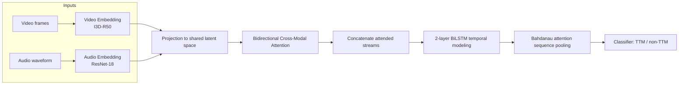
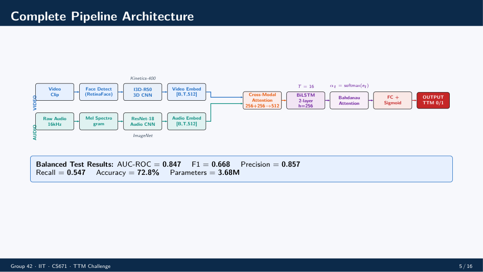

# TTM Active Speaker Detection on Ego4D

This repository contains Group 42's end-to-end solution for the Ego4D Talking-to-Me (TTM) task. The project detects whether a visible person in an egocentric video clip is speaking directly to the camera wearer, using audio, video, and multimodal fusion pipelines.

The codebase is organized around three working tracks:

1. `audio_cnn/` for the audio-only baseline and balanced audio training.
2. `video_cnn/` for the video-only baseline and SlowFast experiments.
3. `fusion/` for the final multimodal system, evaluation scripts, plotting utilities, and report generation.

The repository also includes preprocessing utilities, precomputed checkpoints, experiment logs, and the presentation material used for the project defense.

## Project Summary

TTM is a binary classification problem on short egocentric clips. Given a first-person video segment and its corresponding audio, the model predicts whether the visible person is addressing the camera wearer.

The final multimodal model combines:

- I3D-R50 video embeddings.
- ResNet-18 audio embeddings.
- Bidirectional cross-modal attention.
- A 2-layer BiLSTM for temporal modeling.
- Bahdanau attention for sequence pooling.
- A final classifier for TTM / non-TTM prediction.

The project was designed for a highly imbalanced dataset, so the training and evaluation code emphasizes balanced sampling, threshold tuning, and metrics such as AUC-ROC and F1 instead of accuracy alone.

## Repository Layout

### Root

- `create_balanced_subset.py` creates a balanced subset from the full clip index.
- `README.md` is the project overview you are reading now.

### `audio_cnn/`

This folder contains the audio pipeline.

- `audio_dataset.py` defines the audio dataset and loading logic.
- `audio_model.py` defines the audio CNN used for baseline classification.
- `step_a1_extract_audio.py` extracts raw audio from the source video clips.
- `extract_balanced_audio.py` extracts audio for the balanced subset workflow.
- `train_audio.py` trains the audio baseline.
- `train_audio_balanced.py` trains on the balanced audio split.
- `run_audio_pipeline.sh` is a convenience script for the audio workflow.
- `data/audio_index.csv` stores the main audio clip index.
- `data/balanced_audio_index.csv` stores the balanced audio index.
- `checkpoints/` stores baseline audio checkpoints.
- `checkpoints_balanced/` stores balanced-run audio checkpoints, including `best_model.pth` and epoch snapshots.
- `logs/` stores extraction and training logs.
- `results/` and `results_balanced/` store metrics and outputs.

### `video_cnn/`

This folder contains the video-only pipeline.

- `model.py` defines the video baseline model.
- `model_slowfast.py` defines the SlowFast variant.
- `train.py` trains the standard video model.
- `train_slowfast.py` trains the SlowFast model.
- `train_run.sh` is the shell entry point for video training.
- `checkpoints/` stores the standard video checkpoint.
- `checkpoints_slowfast/` stores SlowFast checkpoints and epoch snapshots.
- `logs/` stores video training logs.
- `results/` and `results_slowfast/` store metrics for the two video experiments.

### `fusion/`

This is the main project folder and contains the final multimodal solution.

- `fusion_dataset.py` builds sliding windows of video/audio embeddings and returns tensors for sequence training.
- `fusion_model.py` defines the final TTM fusion architecture, including projection layers, bidirectional cross-modal attention, BiLSTM, and Bahdanau attention.
- `train_fusion.py` trains the multimodal model with weighted sampling, augmentation, scheduler logic, threshold search, and validation reporting.
- `evaluate_fusion.py` evaluates the fusion model on the validation or test split.
- `evaluate_full.py` runs full-scale evaluation on the unseen full clip index.
- `extract_embeddings.py` extracts and caches video/audio embeddings for downstream training.
- `extract_audio_full.py` handles full-dataset audio extraction.
- `create_balanced_csv.py` and `create_balanced_split.py` generate balanced CSV splits.
- `analyze_distribution.py` checks label and track distribution.
- `score_people.py` computes per-person scores for analysis.
- `generate_report_ppt.py`, `generate_v3_ppt.py`, `generate_focused_ppt.py`, and `generate_presenter_pdf.py` generate presentation artifacts.
- `presentation.tex` and `presenter_guide.tex` contain the LaTeX slides and speaker notes.
- `results/build_report.py` and `results/generate_report_plots.py` create the final report assets.
- `results/` stores HTML reports, metric JSON files, confusion matrices, track-level outputs, and plot descriptors.
- `checkpoints/` stores the fusion model checkpoints, including `best_model.pth` and epoch snapshots.
- `logs/` stores training and pipeline logs.

## End-to-End Workflow

The repository follows a clear pipeline:

1. Build the clip subset and split it by track or person.
2. Extract audio from the source videos.
3. Precompute video and audio embeddings.
4. Train unimodal audio and video baselines.
5. Train the multimodal fusion model on sliding windows of embeddings.
6. Evaluate the final model, tune the threshold, and export the metrics and reports.

The final fusion pipeline is implemented around cached `.npy` embeddings so training is much faster than raw-frame/raw-waveform training.

## Architecture

Below is a high-level architecture diagram showing the main data flow and model components used in the fusion pipeline. This is rendered as a Mermaid diagram which GitHub and many Markdown viewers support.

Key components:
- **Video Embedding:** I3D-R50 backbone producing per-window features.
- **Audio Embedding:** ResNet-18 audio encoder producing aligned audio features.
- **Projection:** Linear layers that align audio/video into a shared latent space.
- **Bidirectional Cross-Modal Attention:** Video attends to audio and audio attends to video.
- **Temporal Model:** 2-layer BiLSTM for sequence-level context and Bahdanau attention for pooling.
- **Classifier:** Final MLP head producing TTM logits and probabilities.

## Model Details

### Audio Baseline

The audio branch uses a CNN over audio representations generated from the extracted signals. The repository includes both the standard and balanced training paths, with balanced-data artifacts stored under `audio_cnn/checkpoints_balanced/` and `audio_cnn/results_balanced/`.

### Video Baseline

The video branch uses a video CNN baseline and a separate SlowFast experiment. The SlowFast branch is kept as a separate training path, with its own checkpoints and metrics in `video_cnn/checkpoints_slowfast/` and `video_cnn/results_slowfast/`.

### Fusion Model

The final multimodal model in `fusion/fusion_model.py` is structured as follows:

- Projection of video and audio embeddings into a shared latent space.
- Bidirectional cross-modal attention, so video queries attend to audio and audio queries attend to video.
- Concatenation of the attended streams.
- A 2-layer BiLSTM for temporal context.
- Bahdanau attention over the sequence of hidden states.
- A classifier head that outputs TTM logits.

The implementation also includes a learned fallback token for missing audio, which helps avoid degenerate attention on zero-filled audio windows.

## Training Strategy

The fusion training code is written to handle class imbalance and overfitting explicitly.

- `WeightedRandomSampler` balances window-level batches.
- `AdamW` is used as the optimizer.
- `ReduceLROnPlateau` lowers the learning rate when validation AP stalls.
- Label smoothing is used in the classification loss.
- Early stopping is driven by validation AP.
- Threshold search is performed after training to improve the precision-recall trade-off.
- Augmentations include modality dropout, temporal masking, Gaussian noise, and MixUp in the fusion training loop.

## Data Artifacts

The repository already contains a substantial amount of generated data and experiment output.

- `audio_cnn/data/` contains audio indices.
- `fusion/results/` contains evaluation outputs such as confusion matrices, JSON metrics, diagnostics, per-person score files, and generated report data.
- `fusion/checkpoints/`, `video_cnn/checkpoints/`, and `audio_cnn/checkpoints_balanced/` contain trained model weights.
- `logs/` directories contain the runtime logs from data extraction and training runs.
- `__pycache__/` folders are present from prior Python runs and are build artifacts rather than source code.
- `fusion/.venv/` is the local Python virtual environment used during development.

## Reported Results

The repository includes multiple result files from different evaluation contexts. The headline numbers documented in the presentation and evaluation outputs are:

- Balanced test-set AUC-ROC: 0.847.
- Balanced test-set F1: 0.668.
- Precision: 0.857.
- Recall: 0.547.
- Accuracy: 72.8%.
- Model size: 3.68M parameters, as reported in the presentation notes.

The repository also includes other evaluation summaries, including track-level outputs and full-dataset metrics in `fusion/results/`. Those files are preserved so the experiment history remains reproducible.

## Presentation Material

The `fusion/` directory also contains the project delivery assets:

- `presentation.tex` for the main presentation deck.
- `presenter_guide.tex` for speaker notes and timing.
- `presenter_guide.pdf` as the compiled PDF.
- `generate_*ppt.py` scripts for presentation generation.
- `results/cs671_midproject_report.html` and `results/cs671_endsemester_report.html` for report delivery.

## How To Reproduce

The exact runtime environment is not fully captured in this README, but the code structure indicates the intended workflow:

1. Prepare the Ego4D clip index files and track-level splits.
2. Run the audio extraction and embedding scripts.
3. Run the video embedding extraction scripts.
4. Train the audio-only and video-only baselines if needed.
5. Train the fusion model with `fusion/train_fusion.py`.
6. Evaluate with `fusion/evaluate_fusion.py` or `fusion/evaluate_full.py`.
7. Generate reports and presentation artifacts from the scripts in `fusion/`.

## Notes On Scope

This repository is focused on experimentation and reporting for the TTM task. It already contains checkpoints, logs, and generated outputs from completed runs, so the repository is closer to a research workspace than a minimal clean source tree.

## Acknowledgement

This project was completed under the guidance of Dr. Aditya Nigam Sir as part of a course at IIT Mandi.

## Group Members

- Naman Khatak
- Kanika Choudhary
- Aman Sharma
- Vikky Kumar
- Vershita Yadav
- Mihir Chandra
- Harshit
- Sowmika Rao

